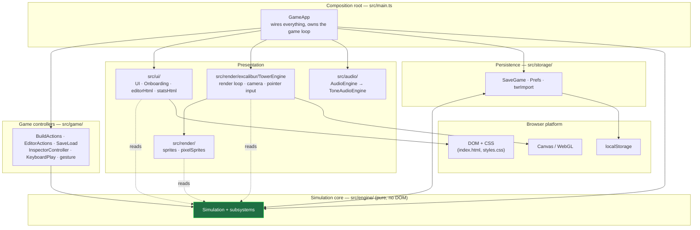
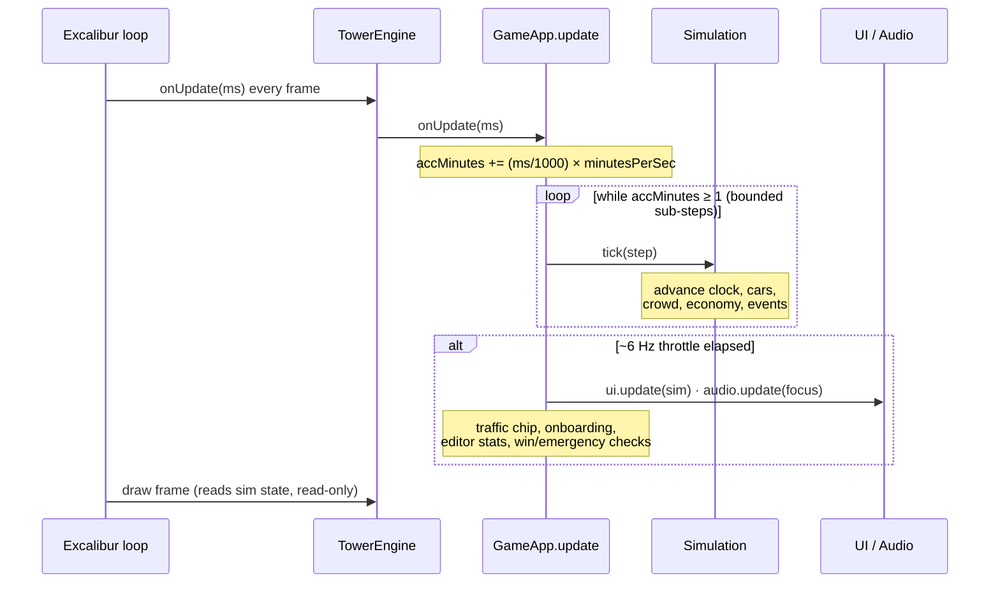
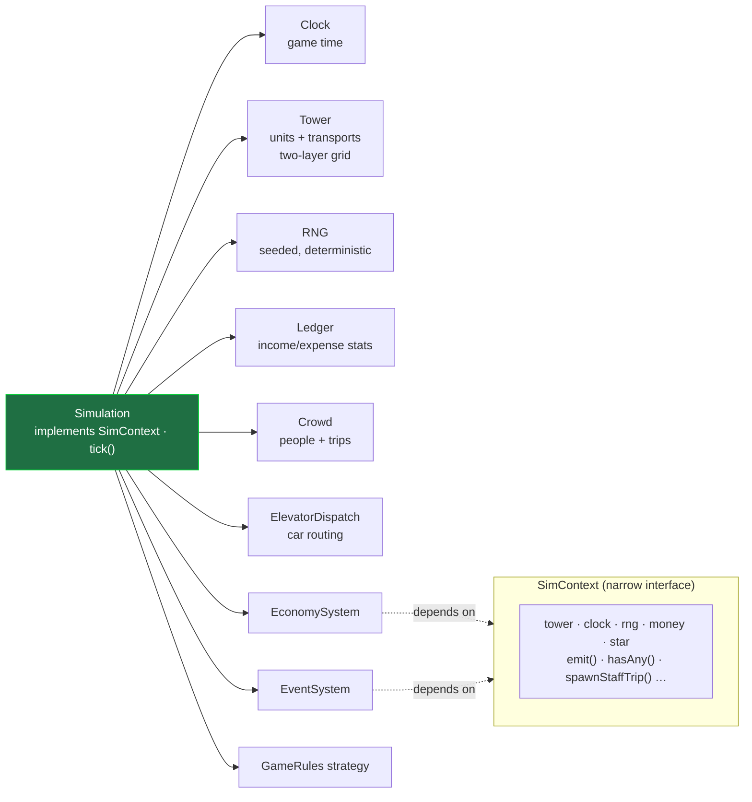
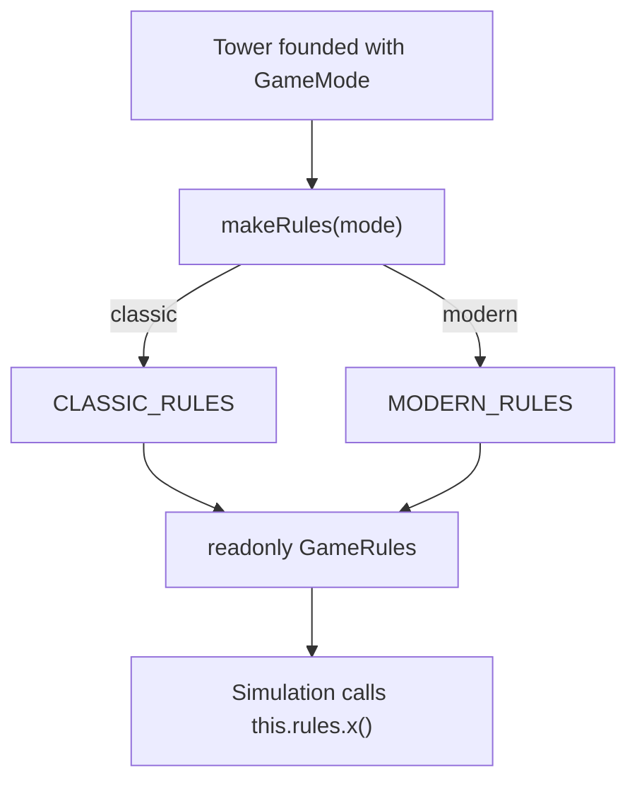
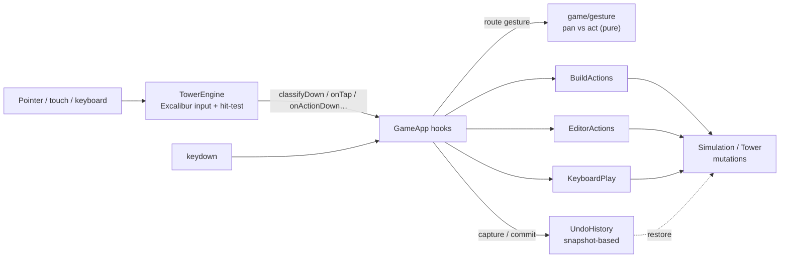

# Architecture

A visual tour of how Verticopolis is put together — the layers, how a frame
flows, how the pure simulation is structured, how input becomes state changes,
and how a tower is persisted. For the prose conventions that govern this
structure (the engine-purity rule, the Classic vs Modern strategy, the two-layer
grid), see [CONTRIBUTING.md](./CONTRIBUTING.md) → **Architecture**; this file is
the diagram companion to it.

The diagrams below are [Mermaid](https://mermaid.js.org/); GitHub renders them
inline.

## The big picture — layers

Verticopolis is a browser game with a **pure, deterministic simulation core**
(`src/engine/`) wrapped by everything that talks to the browser — rendering,
DOM UI, audio, input, and storage. The cardinal rule: **dependencies point
*inward* toward the engine, never out.** The engine imports nothing from
`render/`, `ui/`, `audio/`, or the DOM, which is exactly what keeps it headless
and unit-testable.



**Reading it:** `GameApp` (the composition root) constructs and wires every
other piece. Controllers and the views depend on the engine; the engine depends
on none of them. `TowerEngine` (the Excalibur/WebGL wrapper) owns the actual
render loop and pointer input, and calls *back* into `GameApp` through hooks —
see [Input flow](#input--how-a-click-becomes-a-state-change) below.

## The frame loop — one tick of the world

Excalibur drives a per-frame `onUpdate`. `GameApp` converts real elapsed
milliseconds into in-game minutes (scaled by the current speed), steps the
simulation in bounded chunks, and then — **throttled to ~6 Hz** — refreshes the
comparatively expensive DOM/audio surfaces so panning stays smooth on a busy
tower. Rendering reads engine state every frame but never mutates it.



A thrown frame is contained inside `GameApp.onUpdate` so a transient error skips
a single frame instead of halting Excalibur's loop (which would freeze the whole
game).

## Inside the engine — the simulation core

`Simulation` is the orchestrator. It *implements* the narrow `SimContext`
interface and owns cohesive subsystems, each in its own module. Extracted
subsystems (`EventSystem`, `EconomySystem`) depend only on `SimContext` — not on
the whole `Simulation` — so each can be unit-tested against a tiny hand-rolled
context. `tick()` decomposes time into ≤30-minute sub-steps aligned to hour
boundaries and fans out to the subsystems.



### Classic vs Modern — the rule-set strategy

A tower is founded under an **immutable `GameMode`** (`classic` | `modern`) and
every behavior the two modes disagree on lives behind a single `GameRules`
strategy object, resolved once at founding by `makeRules`. Subsystems call
`this.rules.<x>()` and never re-test the mode string — this is what stops
mode-specific `if` branches from smearing through the simulation.



## Input — how a click becomes a state change

All pointer and camera input goes through Excalibur (`TowerEngine`), which
hit-tests the world and calls back into `GameApp`'s hooks. `GameApp` routes each
gesture — the pan-vs-act decision is pure, unit-tested logic in `game/gesture` —
to the relevant controller in `src/game/`, which performs the build/edit against
the live `Simulation`. Reversible actions are bracketed by `UndoHistory`
snapshots.



## Persistence — saving a tower

`Simulation` serializes to/from a plain `SerializedGame` object. `SaveGame`
persists that to `localStorage` (a periodic autosave slot plus three named
slots), `saveMigration` upgrades older payloads to the current `SAVE_VERSION` on
load, and `twrImport` provides the seam for mapping the original 1994 `.TWR` /
legacy files into the same `SerializedGame` shape — today `parseTWR` recognizes a
`.TWR` file but the binary decoder is still planned, so the import is
foundation-in-place rather than wired up. Per-device accessibility preferences (`Prefs`) live
in their own key, deliberately **off** the save. Undo/redo keeps in-memory
snapshots and is invalidated when a different tower is adopted.

```mermaid
flowchart TD
    Sim["Simulation"] -->|serialize| SG["SerializedGame"]
    SG -->|deserialize| Sim

    SG <--> SaveGame["SaveGame"]
    SaveGame --> Auto["localStorage:<br/>autosave slot"]
    SaveGame --> Slots["localStorage:<br/>3 named slots"]

    TWR[".TWR / legacy file"] -->|twrImport.parseTWR (planned)| SG
    Load["Load from disk/slot"] -->|saveMigration.migrateSave| SG

    Prefs["Prefs (a11y)"] --> PLS["localStorage:<br/>separate key, off the save"]

    Sim -. snapshot .-> Undo["UndoHistory<br/>(in-memory)"]
```

## Where to go next

- **[CONTRIBUTING.md](./CONTRIBUTING.md)** — the contributor guide: dev setup,
  quality gates, testing & coverage, the architecture conventions in prose,
  versioning, and code review. Its **Where things live** table is the quick
  index of every `src/` directory.
- **`src/engine/facilities.ts`** — the single source of truth for build caps,
  facility sizes, and transport pooling.
- **`src/engine/Simulation.ts`** — the orchestrator; start here to follow a tick.
