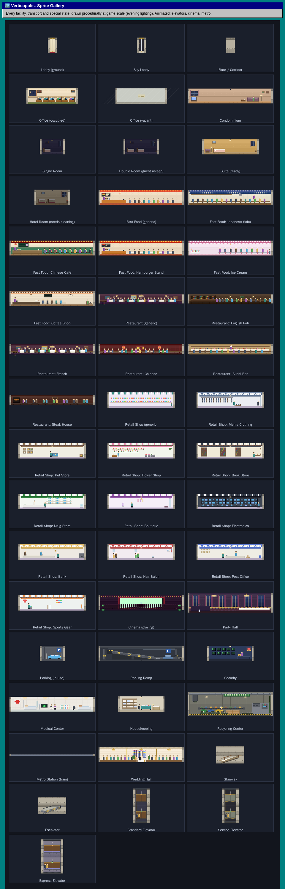
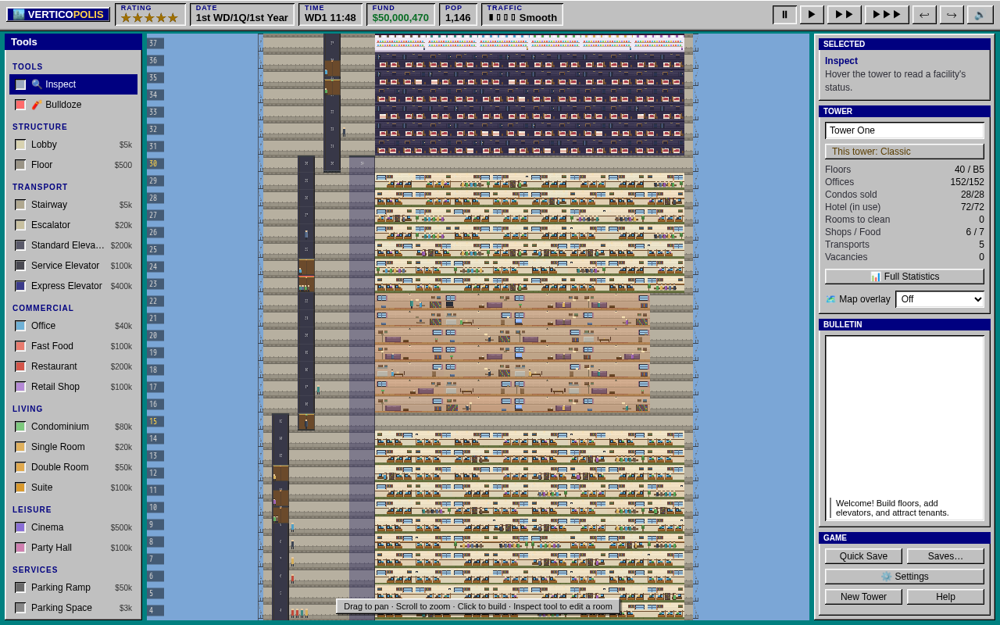
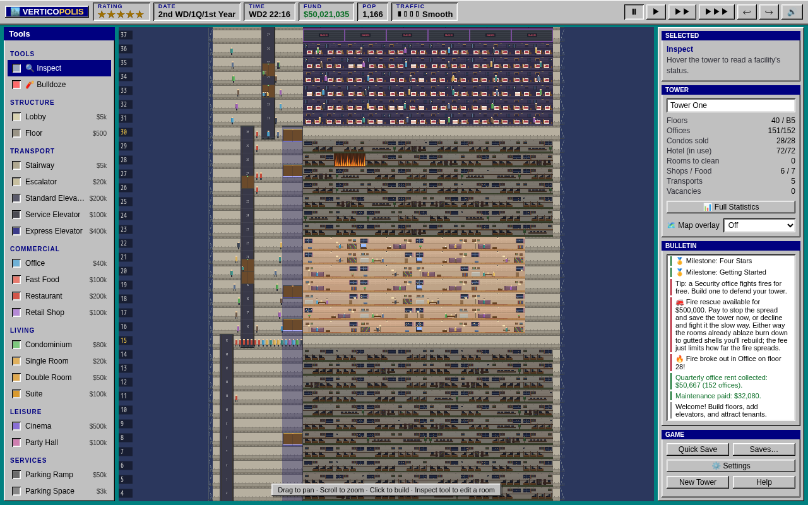
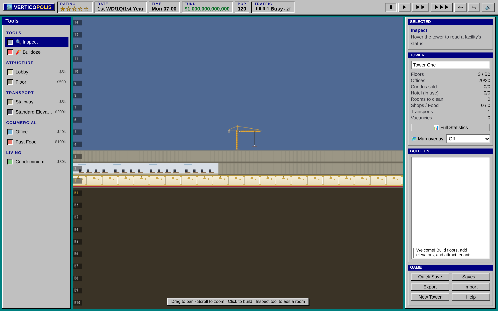
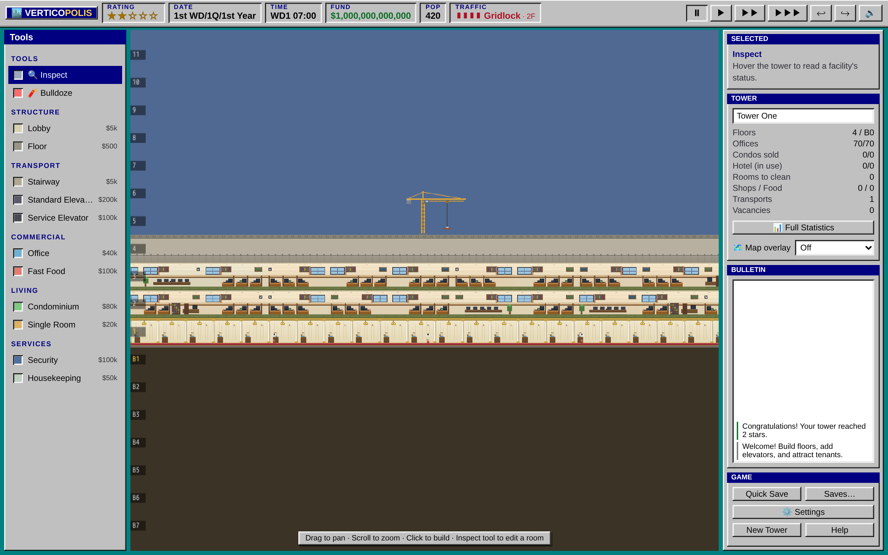
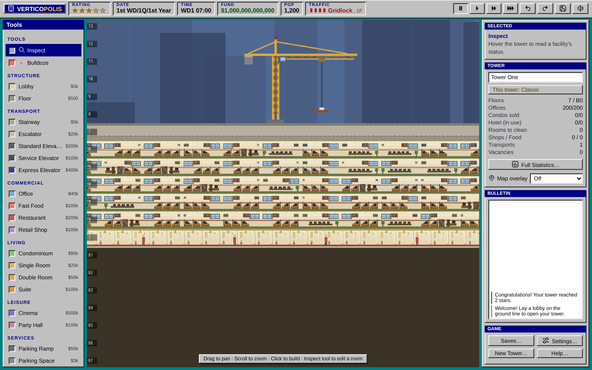
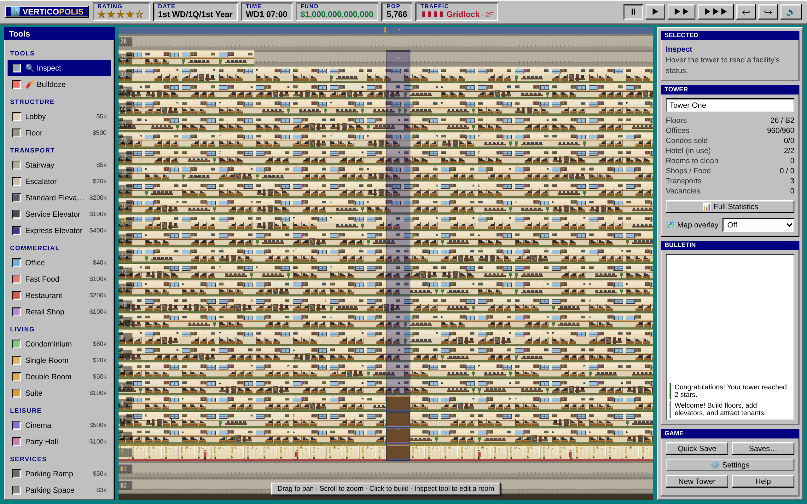
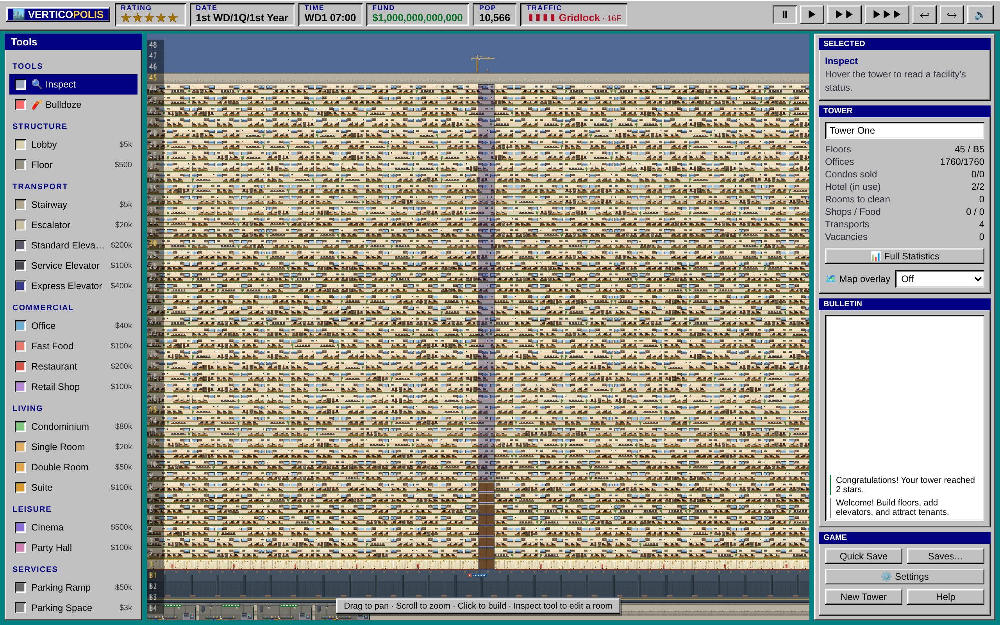
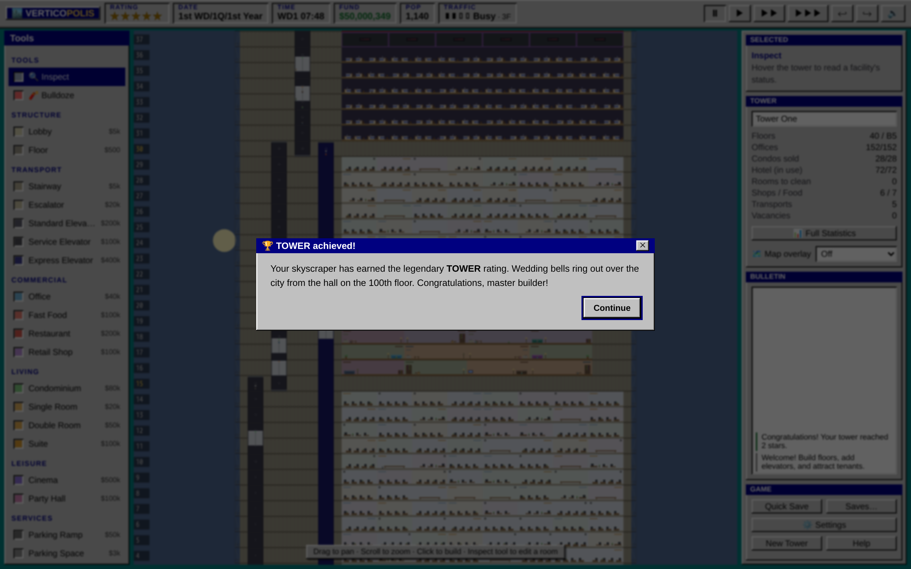

# 🏙️ Verticopolis — a browser SimTower clone

**Play it: [verticopolis.com](https://verticopolis.com)**

A from-scratch, browser-native homage to the classic **SimTower** (1994) — a
vertical metropolis you build floor by floor. Wire it with elevators, attract
tenants, set the rents, keep everyone happy, and climb the star ratings all the
way to a coveted **TOWER**.

Written in **TypeScript** on the **[Excalibur.js](https://excaliburjs.com/)**
game engine (camera, scene, culling, collision and the render loop), with a
procedural **WebAudio** soundtrack that changes depending on which part of the
tower you're looking at. No external art assets — every sprite is drawn in code.



## Play

```bash
npm install
npm run dev      # open the printed localhost URL
```

Other scripts:

```bash
npm run build        # production build to dist/
npm run preview      # serve the production build
npm run screenshots  # build + headless-capture screenshots into docs/screenshots
```

Contributing? See **[CONTRIBUTING.md](CONTRIBUTING.md)** for the dev workflow —
the quality gates (`typecheck`, `lint`, `test`, `build`), the two test tiers, and
the enforced coverage floors.

## Install it (PWA)

The production build (`npm run build`) is an installable **Progressive Web App**.
Open the served build in Chrome, Edge, or Safari and use **Install app** / **Add
to Home Screen** to run Verticopolis in its own window, offline.

It's built on **[`vite-plugin-pwa`](https://vite-pwa-org.netlify.app/)** (Workbox
under the hood) — no hand-rolled service worker. A few details worth knowing:

- **Always the latest, never a lost tower.** When a new version is deployed, the
  game detects the waiting update, **forces a quick save first**, shows a brief
  "updating…" toast, then swaps to the new assets. You always end up on the
  current build and your tower survives the reload.
- **Scoped to the game.** Only the main game registers the service worker; the
  `gallery`/`preview`/`excalibur` tooling pages are excluded from its scope and
  precache.
- **Icons** live in `src/public/` and are generated from an in-code SVG (no
  external art), matching the game's "every sprite drawn in code" ethos. Regen
  with `npm run icons`.

## How to play

- **Found your tower.** *New Tower* lets you pick a **rule-set** — *Classic*
  (pixel-faithful 1994) or *Modern* (adds variant **2–5 person condo
  households**). It's chosen once and fixed for that tower's life; start another
  to play the other way.
- **Build floors first.** Lay `Floor` tiles, then place rooms on top of them.
  The ground floor and every 15th floor want a `Lobby`.
- **Move people.** Every floor needs an `Elevator` or `Stairs` chain back to the
  ground lobby — unreachable tenants get unhappy and leave.
- **Make money.** Offices pay quarterly rent, condos sell once for a lump sum,
  hotels earn nightly (and must be cleaned by `Housekeeping`), and shops,
  restaurants and cinemas earn from foot traffic.
- **Grow your rating.** ⭐ thresholds: 2★ at 300 population, 3★ at 1,000 (needs
  Security), 4★ at 5,000 (needs a Medical Center), 5★ at 10,000.
- **Win.** At 5★ with a Metro Station, build the `Wedding Hall` on floor 100 and
  pass the VIP inspection to become a **TOWER**.

### Controls

| Action | How |
| --- | --- |
| Pan | Drag with the Inspect tool, middle/right mouse, or hold Space |
| Zoom | Mouse wheel |
| Build a room | Pick it from the left palette, click on a floor |
| Build/paint floors | Pick `Floor`/`Lobby`, click-drag |
| Build an elevator/stairs | Pick it, drag vertically to set the span |
| Edit a facility | Inspect tool, click a room or shaft → edit panel |
| Bulldoze | Bulldoze tool, click (or drag) |
| Game speed | Top-right buttons, or number keys `0`–`3` |
| Undo / Redo | `Ctrl+Z` / `Ctrl+Shift+Z` (`⌘` on Mac), or the ↩ ↪ top-bar buttons |

## Features

- **Facilities:** lobby, floors, offices, condominiums, three hotel room grades,
  fast food, restaurants, shops, cinema, party hall, parking, security, medical,
  housekeeping, recycling, metro station and the wedding hall.
- **Transport:** stairs, escalators, and **standard / service / express**
  elevators — each with adjustable car counts and served-floor ranges, edited
  in-game just like the original.
- **Living tower:** people walk the lobbies, elevator cars carry passengers up
  and down, window lights switch on and off, the cinema screen plays, and the
  metro train pulls in and departs. All of it runs off a single global game
  clock — no per-room timers.
- **Economy & time:** weekday/weekend rhythms, morning/lunch/evening rushes,
  quarterly rent, monthly maintenance, nightly hotel revenue, and a daily
  housekeeping cycle (rooms get dirty after checkout and need cleaning).
- **Star ratings** with population thresholds and facility gates, ending in the
  VIP TOWER evaluation.
- **Location-aware soundtrack:** a procedural WebAudio synth crossfades between
  musical "scenes" (lobby muzak, office hum, hotel calm, food-court bustle,
  cinema score, subway rumble…) based on what the camera is centered on, plus
  build/sell/promotion jingles.
- **Save anywhere:** autosave to `localStorage`, multiple save slots, plus
  tower-file (`.vctower`) export/import.

## Saving & loading

**For players.** The game **autosaves** to your browser's `localStorage` and
restores that slot on the next launch. You also get **3 named manual slots** so
you can keep several towers, and **tower-file export/import** for backups or
sharing a tower with someone else — Export downloads your tower as a compact,
compressed **`.vctower`** file (a fraction of the size of the old JSON
exports), and Import loads one back through a file picker. Saves are managed
from the in-game saves panel; clearing your browser storage erases them.

**How it works.** A save is a snapshot of the **headless simulation**, not the
renderer. `Simulation.serialize()` writes the deterministic source of truth —
money, star rating, the game clock, the RNG seed, every unit and transport, the
event system (fires, seasonal events) and excavation history — into a plain
`SerializedGame` object that `SaveGame` stores in `localStorage`
(`src/storage/SaveGame.ts`). On load, `Simulation.deserialize()` rebuilds the
model and the Excalibur scene is regenerated from it.

> **Why not Excalibur's `Serializer`?** Excalibur ships a serializer, but it
> targets the render layer — Actors, Components, the scene graph. In this project
> those are *derived* view state, rebuilt from the simulation whenever the tower
> changes; they hold none of the authoritative game state. Serializing them would
> mean two save paths and a format coupled to the renderer, so the save system
> deliberately serializes the headless `Simulation` instead.

Saves are treated as **untrusted input**. `deserialize()` coerces non-finite
numbers, drops units/transports with an unrecognized kind, and clamps car counts
and shaft heights, so a hand-edited, corrupt, or foreign file degrades gracefully
rather than crashing the game. A `version` field plus a `migrateSave()` seam
gates loading: a save from a *newer* build loads best-effort instead of being
discarded, and any future format change has a single place to add an upgrade
step. The `serialize → deserialize → serialize` round-trip is covered by the
Vitest suite.

`.TWR` import of original SimTower saves has groundwork in place but is not yet
wired up (see the parity table below).

## 1994 SimTower parity

How the clone maps to the original's mechanics. Items marked ✅ are implemented
and covered by the Vitest suite and/or the captured screenshots.

| Original mechanic | Status |
| --- | --- |
| Build floors, then rooms on top; ground + sky lobbies | ✅ |
| Lobby floors are transit-only (no rooms) | ✅ |
| ~100 floors up, basements below, continuous numbering (B1 = floor 0) | ✅ |
| Offices (quarterly rent) | ✅ |
| Condos / apartments (one-time sale, ~2×–2.5× cost, owner buy-back on loss) | ✅ |
| Hotel single / double / suite (nightly, need housekeeping) | ✅ |
| Fast food, restaurant, shop (foot-traffic income, business hours) | ✅ |
| Multi-floor cinema, party hall | ✅ |
| Parking, security, medical, housekeeping, recycling | ✅ |
| Whole-floor basement metro that brings visitors & eases the commute | ✅ |
| Cathedral → **religion-agnostic Wedding Hall** on floor 100 | ✅ |
| Stairs, escalators, standard / service / express elevators | ✅ |
| Adjustable elevator cars + per-floor (express) stop config | ✅ |
| **Demand-driven elevator cars** (SCAN dispatch toward waiting floors) | ✅ |
| Star ratings 1–5 → TOWER, population thresholds + facility gates | ✅ |
| VIP inspection for the final TOWER rating | ✅ |
| Elevator overcrowding stresses tenants; the unhappy leave | ✅ |
| Rush-hour demand (morning/lunch/evening) vs. quiet nights | ✅ |
| Stressed crowds turn red when transport is overwhelmed | ✅ |
| Construction time with scaffolding; destruction/sell refunds | ✅ |
| **Fire** that spreads unless security/medical contain it | ✅ |
| **Bomb threats** (defused by security) on prestige towers | ✅ |
| **Buried treasure** found while excavating basements | ✅ |
| Living tower: walking people, riding cars, the metro train, day/night | ✅ |
| Save/load, multiple slots, .vctower export/import | ✅ |
| `.TWR` original-save import | ⏳ foundation in place (v2) |
| Per-person stress/routing simulation | ◻︎ abstracted as an aggregate model |

**Desktop vs. mobile:** the desktop layout mirrors the original's dollhouse
cross-section; mobile gets a responsive portrait layout with an icon toolbar and
touch pan/pinch (see `docs/screenshots/09-mobile.png`).

## Architecture

```
src/
  engine/      # pure simulation — no DOM
    types.ts        shared types
    facilities.ts   facility catalog, costs, star thresholds, grid constants
    Clock.ts        game time (days, weekdays, day phases, quarters)
    rng.ts          deterministic PRNG (mulberry32)
    Tower.ts        spatial model: two-layer grid, placement rules, reachability
    Simulation.ts   economy, population, satisfaction, ratings, events, save
  render/      # presentation
    excalibur/TowerEngine.ts  Excalibur.js scene: actors, camera, pan/zoom, input
    sprites.ts      procedural per-facility drawing (drawn into Excalibur canvases)
    pixelSprites.ts dollhouse room interiors + walking/seated people
  ui/UI.ts     # palette, status bar, editor panel, modals, toasts
  audio/Audio.ts  # location-based procedural soundtrack + SFX
  storage/SaveGame.ts  # localStorage + JSON import/export
  main.ts      # GameApp: tool semantics, sim tick, glue (input/camera via Excalibur)
  gallery.ts   # standalone sprite-catalog page (docs/screenshots)
  tests/       # Vitest unit tests for the engine
```

The **engine** is deliberately DOM-free and deterministic so it can be unit
tested in isolation (`npm test`). Rendering, the camera, panning, zooming and
pointer input all run on **[Excalibur.js](https://excaliburjs.com/)**:
`TowerEngine` owns the game loop and scene, drawing each facility, transport and
merged structural "run" as an Excalibur actor whose graphic reuses our pixel-art
sprite code. `main.ts` only supplies tool semantics through the engine's
controller hooks and advances the simulation each frame — it never touches the
camera or raw pointer math directly.

For diagrams of the layers, the frame loop, the engine subsystems, input flow,
and persistence, see **[ARCHITECTURE.md](ARCHITECTURE.md)**.

## Screenshots

See [docs/screenshots.md](docs/screenshots.md) for how these are captured and how
to add before/after images to a pull request.

| Day | Night |
| --- | --- |
|  |  |

### From a lobby to a legend — the ★ progression

A humble ground floor climbs the whole rating ladder to the coveted **TOWER**.
These frames are captured by the end-to-end test itself (`e2e/milestones.spec.ts`),
one per rung, so they can't drift from what the game actually does.

| 1★ | 2★ | 3★ |
| --- | --- | --- |
|  |  |  |

| 4★ | 5★ | TOWER |
| --- | --- | --- |
|  |  |  |

## Tests

Two tiers: a fast **Vitest** unit suite (engine, game logic, UI, sprites, audio,
storage — placement, reachability, economy, star gates, housekeeping, save/load
round-trips) and a **Playwright** browser end-to-end smoke that proves the game
stays winnable and renders. Run `npm test` and `npm run e2e` (after
`npm run build`). The full testing strategy — the two tiers, the enforced
coverage floors, and what's unit-tested vs. integration-covered — lives in
**[CONTRIBUTING.md](CONTRIBUTING.md)** → *Testing & coverage*.

## License

The **source code** is **MIT** ([LICENSE](LICENSE)); the original **art and
audio** are **CC BY 4.0** ([ASSETS-LICENSE](ASSETS-LICENSE.md)). To get involved,
see **[CONTRIBUTING.md](CONTRIBUTING.md)**.

---

Built fresh as a clean-room clone — none of the original game's code or assets
are used.
