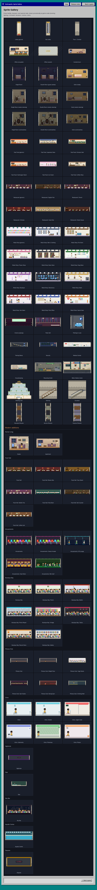
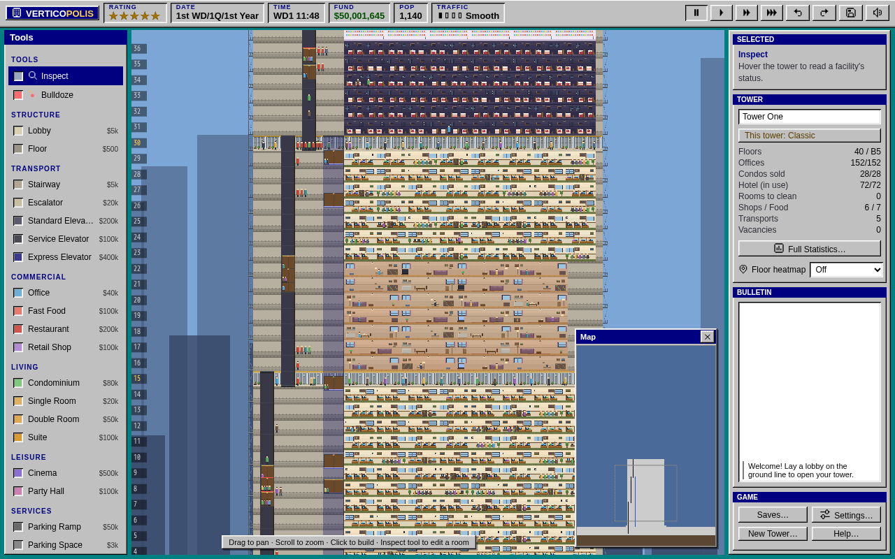
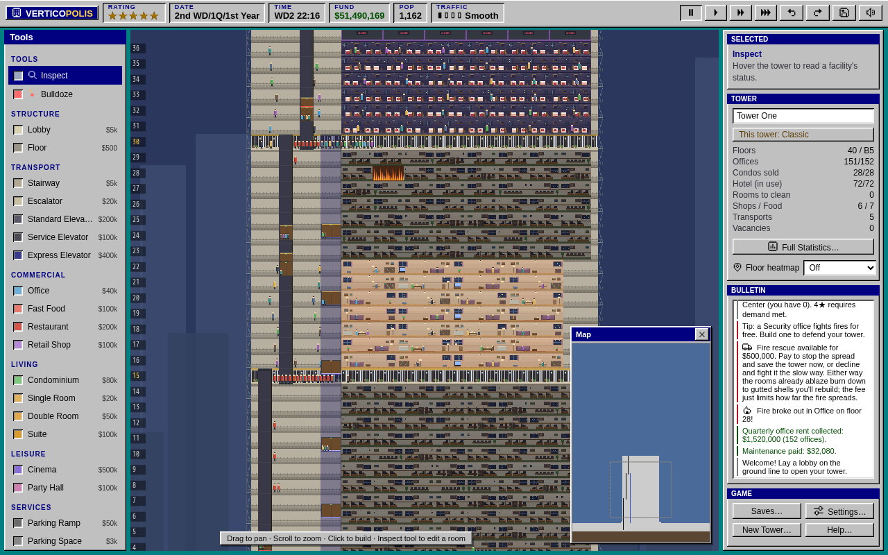

# 🏙️ Verticopolis: a browser SimTower clone

**Play it: [verticopolis.com](https://verticopolis.com)** ·
[How to play](https://verticopolis.com/help/) ·
[Engine docs](https://docs.verticopolis.com/) ·
[Release notes](https://verticopolis.com/help/changelog/)

A from-scratch, browser-native homage to the classic **SimTower** (1994): a
vertical metropolis you build floor by floor. Wire it with elevators, attract
tenants, set the rents, keep everyone happy, and climb the star ratings all the
way to a coveted **TOWER**.

The simulation is a **Rust** engine (`engine-rs/`) compiled to
**WebAssembly**, and it is the only engine the game runs. Everything around it
is **TypeScript** on the **[Excalibur.js](https://excaliburjs.com/)** game
engine (camera, scene, culling and the render loop). A procedural soundtrack
built on **[Tone.js](https://tonejs.github.io/)** changes depending on which
part of the tower you're looking at. No external art assets: every sprite is
drawn in code.



## What's in it

- **Two ways to play.** *Classic* is the 1994 game, rule for rule; *Modern*
  keeps it and adds what the original couldn't do.
  ([Classic and Modern](https://verticopolis.com/help/classic-vs-modern/))
- **Every room from the original**: offices, condos, hotels, shops and
  restaurants, the cinema and party hall, services, the metro and the Wedding
  Hall. ([Rooms](https://verticopolis.com/help/rooms/))
- **Stairs, escalators and three kinds of elevator**, with cars and stops you
  set yourself. ([Elevators](https://verticopolis.com/help/building/elevators/))
- **A living tower** on one game clock: rush hours, quiet nights, people riding
  the cars, lights in the windows, the metro train pulling in.
  ([People](https://verticopolis.com/help/tower/people/))
- **Stars, events and the TOWER**: fires, bomb threats, the VIP and the final
  inspection. ([Stars and the TOWER](https://verticopolis.com/help/tower/stars/),
  [Events](https://verticopolis.com/help/tower/events/))
- **Your towers, kept**: autosave and save slots, `.vctower` files, and the
  original game's `.TDT` saves in both directions.
  ([Saving and loading](https://verticopolis.com/help/your-towers/saving/))
- **Installable and offline** on desktop and phone.
  ([Installing and updates](https://verticopolis.com/help/your-towers/installing/))

How close it is to the original, mechanic by mechanic, is in
[PARITY.md](PARITY.md).

## Quick start

```bash
npm install
npm run wasm:build   # build the Rust engine package (needs the toolchain in engine-rs/README.md)
npm run dev          # open the printed localhost URL
```

The game cannot start without the engine package. On x86_64 Linux,
`bash scripts/build-engine-wasm.sh` installs the pinned Rust toolchain and builds
it in one step.

## Learn more

| Playing | Building it |
| --- | --- |
| [Your first tower](https://verticopolis.com/help/first-tower/) | [CONTRIBUTING.md](CONTRIBUTING.md): setup, quality gates, tests and coverage, versioning, review |
| [Controls](https://verticopolis.com/help/controls/) (mouse, touch, keyboard) | [ARCHITECTURE.md](ARCHITECTURE.md): source layout, the frame loop, input, saves, the PWA |
| [Rooms](https://verticopolis.com/help/rooms/) | [engine-rs/README.md](engine-rs/README.md): working on the simulation |
| [Map and windows](https://verticopolis.com/help/tower/map-and-windows/) | [docs.verticopolis.com](https://docs.verticopolis.com/): the engine package, crate, API and conformance |
| [Importing and exporting](https://verticopolis.com/help/your-towers/importing-exporting/) | [docs/canon/tdt-format.md](docs/canon/tdt-format.md): the `.TDT` save format |
| [The whole manual](https://verticopolis.com/help/) | [docs/screenshots.md](docs/screenshots.md): the screenshot gallery and how it is rendered, including the [1★ to TOWER ladder](docs/screenshots/milestones/) |

## Screenshots

| Day | Night |
| --- | --- |
|  |  |

## License

The **source code** is **MIT** ([LICENSE](LICENSE)); the original **art and
audio** are **CC BY 4.0** ([ASSETS-LICENSE](ASSETS-LICENSE.md)). To get involved,
see **[CONTRIBUTING.md](CONTRIBUTING.md)**.

---

Built fresh as a clean-room clone. None of the original game's code or assets
are used.
