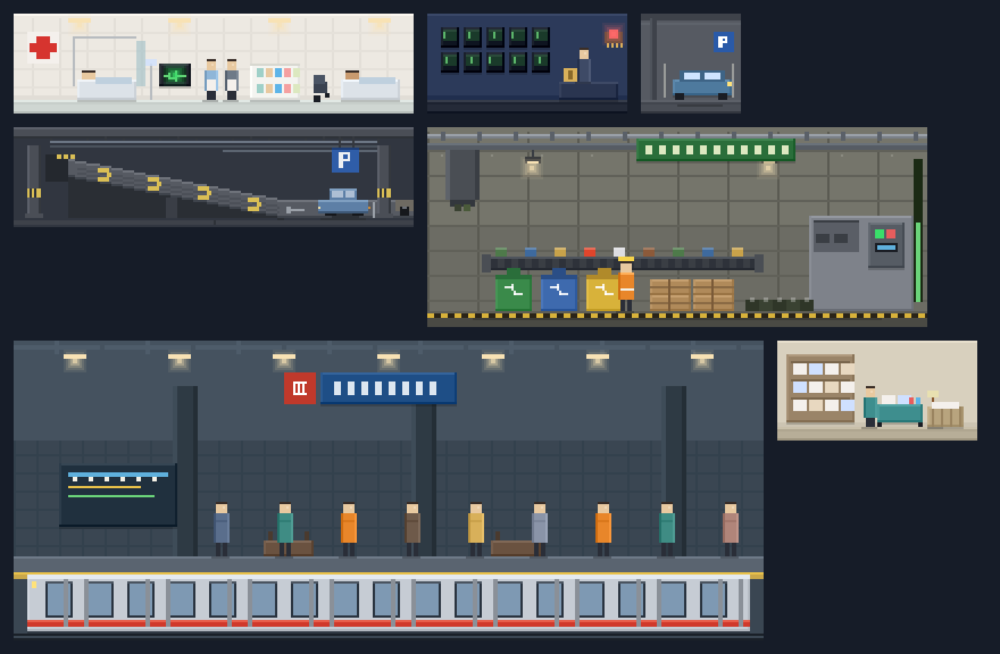
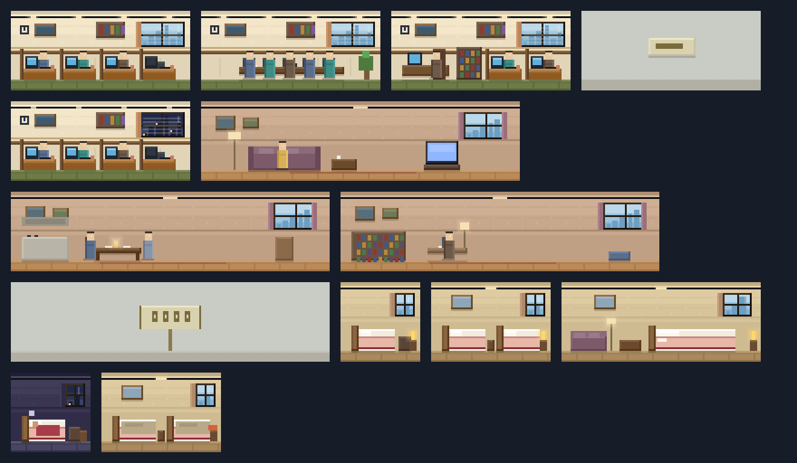
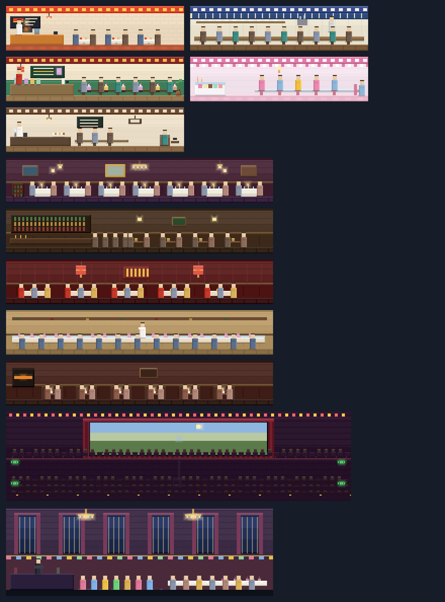
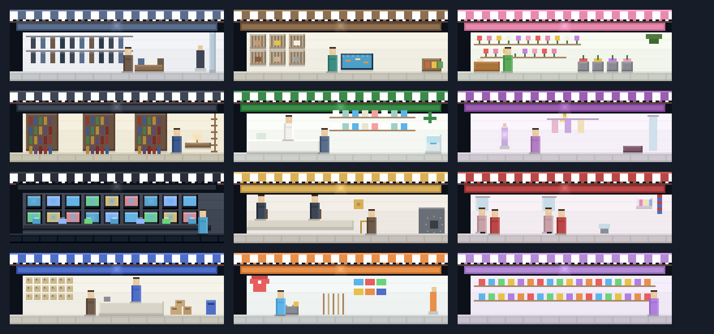
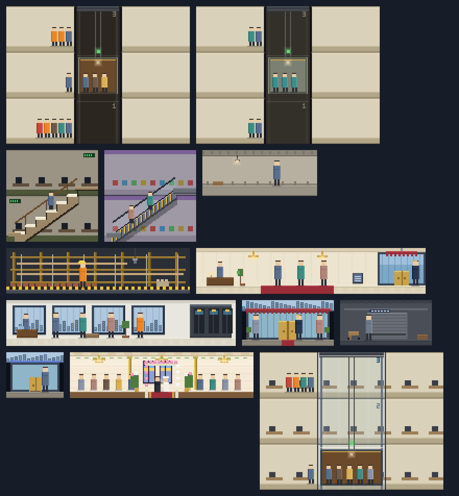

# Pixel-Art Overhaul: Ratified Art Direction

Design party: Game Designer (Samus Shepard), UX Designer (Sally), Game Architect
(Cloud Dragonborn). This brief is the source of truth the `/gds-code-review`
Acceptance Auditor checks the implementation against. Goal: move every room into
the 1994 SimTower narrative visual style with original clean-room art. We match
the narrative style, we do not copy any SimTower asset.

## Figma source of truth (visual canon)

The reference mood board is the authoritative visual target. Every composition,
prop count, palette choice, people scale, and state cue in the specs below is
read from it. The shipped art stays 100% procedural Canvas 2D and original; the
board is a clean-room reference, never an imported asset.

- **File:** Figma design `2nFfdgPNNSVo6xBqEP8OCz`
  (`https://www.figma.com/design/2nFfdgPNNSVo6xBqEP8OCz`).
- **Board scale:** most pages draw tiles at PS=3 (3x); the actors and events
  page (page 08) draws its small standalone sprites at PS=6 (6x) for legibility.
  The true in-game module is `TILE = 11px` wide and `FLOOR = 44px` tall
  (`src/render/scale.ts`); a 1-floor room is 44px tall, a 2-floor venue 88px. All
  pixel numbers in these specs are **true in-game pixels**; to convert a board
  measurement back, divide by that page's scale (3 for most pages, 6 for page 08).
- **Stable anchors are page + tile name.** Node IDs are a snapshot (2026-07-14);
  re-rendering a tile mints new IDs, so cite the tile by name and only use IDs as
  a convenience. Pages:

| Page | Board frame | Tiles (name -> node id snapshot) |
|---|---|---|
| 01 Utilities & Services | `1:2` | Recycling Center 20x2 `104:2`; Metro Station 30x3 `104:319`; Medical Center 16x1 `104:655`; Security 8x1 `104:792`; Housekeeping 8x1 `104:917`; Parking Space 4x1 `20:261`; Parking Ramp 16x1 `64:2` |
| 02 Offices & Residential | `25:3` | Office cubicle `100:4` / meeting `100:224` / executive `100:412` / vacant `100:630` / night `100:660`; Condo living `100:868` / dining `100:1040` / study `100:1215` / for-sale `100:1411`; Hotel Single-ready `100:1458` / Double-ready `100:1529` / Suite-ready `100:1636` / Single-asleep `100:1760` / Double-dirty `100:1830` |
| 03 Food & Entertainment | `29:3` | Fast food: Hamburger `99:4` / Soba `99:342` / Chinese Cafe `99:595` / Ice Cream `99:802` / Coffee `99:994`; Restaurant: French `99:1163` / Pub `99:1685` / Chinese `99:2155` / Sushi `99:2589` / Steak `99:3010`; Cinema 31x2 `99:3464`; Party Hall 24x2 `99:4942` |
| 04 Retail | `57:3` | Men's `101:4`; Pet `101:166`; Flower `101:365`; Book `101:548`; Drug `101:748`; Boutique `101:895`; Electronics `101:1023`; Bank `101:1362`; Salon `101:1507`; Post Office `101:1661`; Sports Gear `101:1841`; Generic `101:1971` |
| 05 Structure & Transport | `62:3` | Floor/Corridor `103:2`; Under Construction `103:53`; Ground Lobby + grand entrance `103:187`; Sky Lobby `103:360`; Grand Entrance `103:631`; Service Entrance `103:796`; Standard Entrance `103:855`; Wedding Hall 16x1 `103:923`; Stairway 8x2 `80:2`; Escalator 8x2 `80:315`; Standard Elevator `84:3`; Service Elevator `84:210`; Express Elevator (see-through) `90:2` |
| 06 People Scale (calibration) | page `81:2` | Owner-confirmed room-occupant vs walker sizes |
| 07 People System | page `82:2` | Classes, sizes, mood colors |
| 08 Actors, Vehicles & Events | page `92:2` | Garbage/recycling truck; Metro train; Street car; Thief (crime event); Santa (Christmas event) |

### Rendered module gallery + reference draw code

The board file is not reachable from CI (the egress policy blocks `figma.com`),
so every tile is rendered locally from the exact rectangle arrays that built it
and committed under `pixelart-figma/`. The output is pixel-identical to the
board. Each `F(A, x, y, w, h, color, opacity)` rectangle maps directly to a
Canvas 2D `ctx.fillStyle = color; ctx.globalAlpha = opacity; ctx.fillRect(x, y,
w, h)`, so the build scripts double as the reference draw code for the Excalibur
bake: the render implementation is a port of these, keyed to the real screen
rect rather than a re-derivation from prose.

Contents of `pixelart-figma/`:

- `page-0X-*.png`: the six page overviews (every module of a page in one image).
- `tiles/*.png`: all 63 individual module tiles, one PNG each.
- `build-scripts/*.build.js`: the pixel-exact draw source per page (the tile
  functions plus the shared `F` / `box` / `person` helpers). The people figures
  in these use the finalized geometry above.
- `rasterize.mjs`: a dependency-free Node renderer (pure `zlib` PNG writer) that
  regenerates every PNG from the build scripts. Run `node rasterize.mjs`.
- `manifest.json`: the page-to-tile map with each tile's pixel size.

**01 Utilities & Services** (recycling, metro, medical, security, housekeeping, parking, ramp)

**02 Offices & Residential** (3 office layouts + states, 3 condo layouts + for-sale, 3 hotel grades + asleep/dirty)

**03 Food & Entertainment** (5 fast food, 5 restaurants, 2-floor cinema, 2-floor party hall)

**04 Retail** (11 canon trades + the generic fallback)

**05 Structure & Transport** (floor, construction, ground + sky lobby, three entrances, wedding hall, stairs, escalator, three elevators)

**08 Actors, Vehicles & Events** (garbage truck, metro train, street car, thief, Santa)

## Narrative pillars

- Warm dollhouse feel. Every room is a lit, furnished cross-section.
  Cream and warm-gray walls, never cool blue-gray. Interiors read brighter than
  the shell.
- Density tells the story. Each cell earns 3 to 5 readable props plus at least
  one silhouette doing an activity. A lived-in room beats an accurate one.
- One iconic silhouette per kind. A player skimming a 60-floor tower names each
  room from its single strongest shape. Legibility at 16px beats detail.
- Warm light from within, cool world outside. Rooms glow amber; windows and
  lobbies show a cool skyline behind, so warmth reads against distance.

## Canonical palette (new `PAL` keys, luminance-validated against night scrim + heatmap)

| Key | Hex | Role |
|---|---|---|
| `warmWall` | `#ECDFC2` | warm cream interior wall |
| `carpetGreen` | `#6E7A48` | olive office carpet |
| `hotelPink` | `#E8B7A8` | warm hotel bedding pink |
| `hotelRed` | `#A83C4A` | deeper hotel red (headboard, drapes, trim) |
| `skyDay` | `#9CC4DE` | day sky band in window views |
| `skyNight` | `#2A3350` | night sky band in window views (background only) |
| `cityLight` | `#F3D08A` | warm distant-window dot |
| `awningShadow` | `#5A4038` | shaded band under awnings/canopies |
| `signWarm` | `#EE8844` | warm marquee/sign fill |
| `glowLit` | `#F8E2B4` | warm lamp glow, lit |
| `glowDim` | `#8A7A5C` | same lamp, unlit/dim |
| `walnut` | `#6B4A2B` | dark furniture wood (desks, headboards) |
| `oak` | `#A9743C` | mid furniture wood |

None equal a reserved value. Reserved (never reused by decoration): stress red
`#C24A3A`; state cues vacancy grays `#C9CCC4`/`#B2B0A4`, notice amber `#E8A030`,
dirty tray `#D4623A`, ready lamp `#FFD86A`, closed sign `#E0556B`. Existing `PAL`
keys stay unchanged (wall, floor, slate, brass, red, blue, green, ink, white,
wood). Variants jitter each color by at most 10 per RGB channel around an anchor.

## Legibility rules (state cues always win)

- LEASE/SALE card and closed shutter keep a 1px ink `#2A2E38` outline plus a
  white `#F4F0E4` inner field before the colored glyph. Never paint a card
  directly onto a warm wall.
- Notice ribbon and dirty tray keep a 1px ink separator from any `signWarm` /
  `hotelRed` decoration (same hue family). Reserve warm-orange for state.
- Ready lamp keeps its ink socket ring; `glowLit`/`cityLight` are paler ambient
  and never adjacent to a ready lamp.
- Asleep "z" is ink (or white with an ink edge over `hotelRed`).
- Silhouettes are ink, minimum 3px wide with a 1px gap between neighbors, on a
  1px slate `#5A6E8C` baseline under the feet. Count equals occupant count: fill
  an explicit seat/stand grid in seed order; one row reads up to ~8-12, then a
  second parallax row (1px shorter, 1 shade lighter), never sub-3px widths.
- Window views recede: `skyDay`/`skyNight`/`cityLight` sit behind an ink/slate
  mullion grid, muted, never brighter than `glowLit` or more saturated than a
  foreground prop; `cityLight` dots are 1px and sparse so they never look like
  occupants.

## Architect constraints (enrich in place, do not rearchitect)

- Bake signature (`TowerEngine.ts` ~1632) is
  `` `${state}:${litState?1:0}:${width}:${occupants}:${outForMeal ?? 0}:${subtype ?? ""}:` ``
  followed by the concatenated flag characters `open` + `lateNight` + `dead` (no
  separators between those three), then an optional `liveBits` suffix (`:pN` for
  parking use, `:rN` for recycle fill, otherwise the empty string). Decorative
  art reads only these inputs. `windowView`/`roomGlow` key on `lit` (in the signature), never
  `d.anim`. No new `d.anim` reads in cache:true rooms; only fire/construction
  redraw per frame. Cinema's marquee is the accepted exception.
- geoVariant axis discipline: each kind uses distinct axis integers; document a
  map. Determinism across TDT save/load is automatic (pure fn of kind/floor/x).
- Integer pixel coordinates only.
- Retail subtype list order is a load-bearing TDT ordinal: touch only look-table
  values and draw functions, never keys/order.
- Files stay under the 500-line ceiling: extract look tables before enriching.

## Per-kind look bible

- office: olive carpet `carpetGreen`, walnut desks, cream walls, cool back
  window. 2-3 desk rows with beige monitors (dark screen + green power dot),
  filing cabinet, aisle plant. Seated silhouettes per desk, one at the window.
  Icon: brown desk rows on green carpet.
- condo: warm maple floor, cream walls, rose accent, sky window. Stuffed sofa,
  low coffee table, boxy TV, bed nook or bookshelf, hanging lamp. Icon: sofa +
  TV with a warm lamp glow. Keep the standing-lamp home-glow signal.
- hotelSingle: `hotelPink` bedding, walnut headboard, cream wall, brass lamp.
  One single bed with a plumped pillow, nightstand + brass lamp, framed picture,
  warm curtain window. Icon: single pink bed with a brass nightstand lamp.
- hotelDouble: same warmth, two beds sharing a central nightstand + lamp,
  luggage rack, wall picture. Icon: twin pink beds flanking one brass lamp.
- hotelSuite: deeper rose bedding, walnut + brass, a wine-red lounge chair,
  small chandelier, coffee table, mirror, skyline window. Icon: big rose bed
  plus a separate lounge chair under a chandelier.
- fastFood: bright quick-serve. Warm tile, cream walls, bold subtype sign color,
  counter with register, lit overhead menu board, 2-3 round tables + stools.
  Icon: lit menu board over a counter with a queued figure.
- restaurant: sit-down warmth. Warm wood floor, burgundy accents, amber pendant
  lights, 3-4 dressed tables (white-cloth dots), host stand or bar, waiter.
  Icon: white-clothed tables under warm pendants.
- cinema: deep maroon walls/carpet, near-black seats, a bright cool screen,
  red exit strip, projector glow. Icon: bright screen glow over raked dark
  seat-heads. Keep the animated marquee/screen.
- shop: cream interior, saturated subtype awning + lit sign, glass display
  window, 2 shelving units of colored goods, counter + register, clerk +
  customer. Icon: striped awning + lit sign over a glass display window.
- partyHall: warm gold accents, wine-red carpet, string lights, long banquet
  table + light cloth, small stage, round side tables. Icon: banquet table
  under string lights with a banner.
- lobby: bright airy gateway. Polished cream/marble floor with warm veining,
  tall glass front showing the cool skyline, brass trim, reception desk + lamp,
  planters, bench, crossing figures. Icon: tall glass wall with skyline, a
  reception desk, a crowd crossing. Keep the 4 lobby variants + entrance
  sentinels.
- elevator cars: brass + walnut interior, warm ceiling dot, dark shaft outside,
  1-3 packed silhouettes. Keep express glass shaft, floor-number legibility,
  FULL red bar, direction lantern.
- stairs: warm tan treads, walnut rail, cream wall, a climbing figure on the
  diagonal. Escalator: metallic warm-gray steps, brass side, amber edge dots,
  evenly spaced riders.
- parking: cool concrete gray (deliberate cool exception), yellow bay stripes,
  boxy warm-colored cars, support pillar. Keep parkingUse/parkingDead car
  visibility.
- security: cream walls, navy trim, a wall of small green-dot monitors, seated
  guard, badge. medical: white/cream, mint accents, red cross, white exam bed,
  attendant. housekeeping: warm tan, teal cart, stacked white towels + mop.
  recycling: warm-gray concrete, green/blue bins, brown bales, vested worker;
  keep the recycleFill pile + gauge (FULL red).
- metro: cool tunnel gray-blue (underground exception), warm platform tile,
  amber lights, a colored train, a waiting crowd. Keep the train actor.
- weddingHall: ivory + blush walls, gold accents, a floral arch over a white
  aisle runner, ribboned chairs, candelabra, a couple at the altar.

## Retail subtypes (signature look + sign color; do not reorder keys)

Fast food: Japanese Soba (indigo noren, noodle bowl), Chinese Cafe (lantern red
+ gold), Hamburger Stand (ketchup red + mustard yellow, burger icon), Ice Cream
(pastel pink, cone), Coffee Shop (espresso brown on cream, cup + steam).

Restaurant: English Pub (racing green + gold hanging sign, barrels, amber
glasses), French (navy on cream, bistro chairs), Chinese (imperial red + gold,
lazy-Susan round table, lanterns), Sushi Bar (indigo + natural wood, nigiri),
Steak House (oxblood booths, dark wood, low lamps).

Shop: Men's Clothing (charcoal navy suits + mannequin), Pet Store (teal + orange
paw, cages/tank glow), Flower Shop (leaf green awning, multicolor blooms), Book
Store (deep brown walnut shelves, reading lamp), Drug Store (medical green cross
on white, bottle shelves), Boutique (plum magenta, one spotlit dress), Electronics
(electric blue, wall of cyan screens), Bank (gold on deep green, teller counter +
brass), Hair Salon (pastel pink + chrome, mirror + chair + pole), Post Office
(postal blue + red, mailbox + parcels), Sports Gear (energetic orange, ball +
equipment racks).

## People system (classes, mood, size, and honesty)

The sims are single-color silhouettes, as in the 1994 original: SIZE and
silhouette signal the class, COLOR signals mood.

- Classes (distinct silhouette + height): child (small), woman (skirt), man,
  office worker (briefcase), businessman (hat), tourist (bag), housekeeper
  (uniform), security (cap), doctor/nurse (white coat), elderly (cane, gray).
  Pick the class from what the sim actually is in the sim (worker, guest,
  shopper, staff) rather than at random.
- Two context scales: a sim INSIDE a module reads smaller (about a third of the
  module height); a sim WALKING the tower (lobby, corridor, transport landing)
  reads larger (about half to two-thirds). Room occupants use the smaller
  scale; lobby/transport figures use the larger.
- Mood is the fill color: content sims wear their class color (the `SHIRTS`
  palette, never the reserved stress red); they warm to amber when impatient
  (long waits) and to the reserved stress red `#C24A3A` when fed up, so a red
  crowd reads instantly as a transport/service problem. No class color may equal
  the stress red (existing `SHIRTS` rule).
- NO GHOST PEOPLE. The only people drawn are real occupants and visitors from
  the population. Never scatter random pedestrians pacing an empty lobby. Room
  figures map to `visibleOccupants(u)`; lobby/corridor/transport figures map to
  real routed sims and appear only when traffic is actually present. An empty
  tower reads empty. The current decorative `scatterPeople` (party hall, metro
  platform) and any constant lobby crowd must become occupancy/traffic-driven,
  not constant decoration (tracked as a follow-up in the backlog).
- ELEVATOR QUEUES ARE VISIBLE. As in the original, sims physically line up at
  each floor's elevator/escalator landing while they wait. Queue length reflects
  real demand at that floor and the queue tints toward amber then stress red as
  waits grow, so the player can see congestion on the affected floors. Draw the
  waiting line at the shaft landing on each served floor, rather than only a count.
- QUEUES ARE THE SAME TRACKED SIMS. When a car arrives, the sims already in that
  floor's queue board in order up to the car's remaining capacity; whoever does
  not fit stays in the SAME queue (same individuals) and waits for the next car.
  Nobody is spawned to fill a car or discarded when it leaves. The car FILL is
  those boarded sims (drawn inside the car up to capacity), and the leftover line
  is the same people who were there, now shorter. Boarding = queue minus who fit.
- CAR FILL IS VISIBLE. Draw the actual passengers inside the car (silhouettes up
  to the car's capacity), so a packed car vs. a near-empty one reads at a glance,
  and it matches the queue math above.

### Finalized people pixel geometry (owner-approved 2026-07-14, Figma pages 06-07)

The calibration was confirmed on the board and then enlarged after owner review
("too tiny" -> a clearly bigger, wider, more human figure). These are the exact
true-in-game pixel builds every tile uses. Head is skin `#E8C9A0` with a 1px hair
line `#3A2E28` and a 1px eye highlight `#F0D8B8`; torso is the mood/class color
with a 1px darker left edge (`shade -26`) and 1px lighter right edge (`shade +16`);
a 1px contact shadow sits under the feet. Integer coordinates only.

| Figure | Build (head + torso + legs) | Total | Width | Where |
|---|---|---|---|---|
| Seated room occupant | 5 + 10 + 0 (no legs) | 15px (~1/3 module) | 6px | diners, seated office/condo workers and readers, wedding guests, and behind-counter/desk staff (receptionist, tellers, pharmacist, guard, barista, cook) |
| Standing room occupant | 5 + 9 + 4 | 18px | 6px | staff standing in the open inside a module (medical nurse/doctor, housekeeper) |
| Walker | 5 + 13 + 6 | 24px (~55% module) | 7px | ground + sky lobby crossers, the three entrances, the metro platform crowd, any corridor/transport-landing traffic |
| Transport rider (shipped) | 4 + 9 + 4 | 17px | 6px | stairs / escalator riders on the incline (already on the board; keep) |
| Hi-vis worker (special) | 5 + 12 + 5 + hardhat | ~22px | 7px | recycling-plant vested worker |

- **Two-scale rule, made precise:** inside a module -> the 15px (seated) or 18px
  (standing) occupant; walking the tower -> the 24px walker. The walker is the
  bigger "outside a module" size; occupants are the smaller "inside" size.
- **Mood is the torso fill:** content = class / `SHIRTS` color; impatient = amber
  `#E8862A`; fed up = reserved stress red `#C24A3A`. No class color equals the
  stress red. The board shows the amber "impatient" tint on a couple of sky-lobby
  and metro-platform walkers as the live cue.
- **No ghost people, enforced on the board:** lobby and metro crowds were thinned
  to a few real occupants; captions state that only real building population
  appears, never ambient pedestrians. Room figures still map to
  `visibleOccupants(u)`; walker figures map to real routed sims.

## geoVariant axis map (extend, never reuse within a kind)

- office: 0 wall band, 1 wall item, 2 plant desk, 3 layout, 4 mirror. New: 5 window seed.
- condo: 0 wall, 1 picture, 2 right slot, 3 layout, 4 mirror. New: 5 window seed.
- hotel: 0 wall tint, 1 mirror. New: 2 window/curtain seed.
- cinema: 4 audience. New: 5 marquee color seed (still keyed via anim as today).
- shop/food subtypes: look table is subtype-keyed (no geo axis); any added
  garnish uses a new axis >= 6.

## Canon updates since the first draft

- **Party hall is two floors (shipped on main).** The catalog gained
  `floors: 2` and the v5->v6 save migration `expandLegacyPartyHalls` grows or
  relocates every legacy 1-floor hall (PR #242). The board's Party Hall tile is
  24 tiles x 2 floors to match; the art spec targets the two-floor composition,
  and the earlier "party hall 2-floor engine fix" backlog deferral is closed.
- **Cinema exits on both floors** stays as designed (green EXIT signs on each of
  the two floors), matching the two-floor venue rule.

## Document set (BMGD planning)

This bible is the ratified art direction and the Figma source-of-truth index:
the GDD-layer canon the rest of the planning set and the implementation are
measured against. This is the planning (spec) PR; the render-code implementation
follows in a separate PR.

The rest of the BMGD planning set ships in this same PR, each artifact derived
from the same Figma board and citing this bible:

- GDD (design intent + per-kind narrative), under
  `planning-artifacts/design/gdd-pixel-art-overhaul-*.md`.
- Game architecture (render-engine mapping: bake signature, geoVariant axis,
  file-size strategy, the `person()` family, and the elevator queue / car-fill
  engine seam), under `planning-artifacts/design/arch-pixel-art-overhaul-*.md`.
- Epics + stories (the overhaul sequenced into buildable stories), under
  `planning-artifacts/design/epics-pixel-art-overhaul-*.md`.
- Per-domain implementation specs (house format) under
  `implementation-artifacts/spec-pixelart-*.md`: people system; tenant rooms;
  food and entertainment; retail; utilities and service; structure, lobbies and
  transport; unit states; actors and events.
