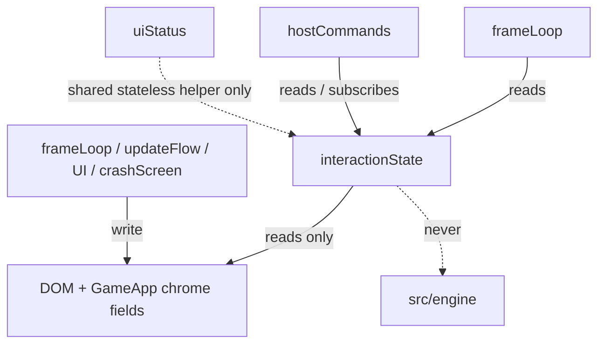

# Architecture Spine, interaction-state consolidation

The gate before code for issue #716. It fixes the invariants the refactor must
hold and marks what stays open for the owner. It does not authorize the
refactor, and it invents no answer it does not have.

Written against `main` plus the incoming #715 command seam. Nothing here needs
#715's internals, only its existence as the integration point.

## The problem it governs

Five places answer "can the player interact right now", and nothing requires
them to agree:

| Source | Where | Means |
| --- | --- | --- |
| `app.shownChoice` | `main.ts:99`, set in `frameLoop.ts` | emergency-choice modal is up |
| `app.shownUpdate` | `main.ts:111`, set in `frameLoop.ts` | update modal is up |
| `#modal.open` | DOM dialog | any modal dialog is open |
| `#splash` exists | DOM | title screen is up |
| `#crash-screen` exists | `crashScreen.ts` (`CRASH_SCREEN_ID`) | renderer died |

The pair `shownChoice`/`shownUpdate` implies `#modal.open`, but not the reverse:
a save dialog or the New Tower picker sets `#modal.open` with neither flag. The
gap is not theoretical. PR #715's review found the host-command availability
push sitting below `runFrame`'s early return on `shownChoice || shownUpdate`, so
in the dialog-open-no-flags state the push fired and told the desktop menu every
command was available, in exactly the state where `#modal.open` refused all of
them. #715 fixed that instance; this spine governs the class.

## Design Paradigm

One module, `interactionState` (home per AD-6), is the single owner of the five
sources. Everything that needs to know "can the player interact" asks it;
nothing else reads a raw source. This is a facade, not a store: plain
synchronous reads of DOM and `GameApp` chrome fields, no reactive graph, no
subscription to `sim`.

## Invariants & Rules

### AD-1 — one module owns all five sources [ADOPTED, issue #716 bar]

- **Binds:** every reader of "can the player interact now".
- **Prevents:** two sources disagreeing (the #715 defect).
- **Rule:** no code outside `interactionState` reads `app.shownChoice`,
  `app.shownUpdate`, `#modal.open`, `#splash` existence, or `#crash-screen`
  existence directly. This is the bar: the refactor ships only if it owns all
  five. Owning two would add a sixth reader, not remove four, so a partial
  consolidation does not ship.

### AD-2 — a mode query plus a change notification, not a polled flag bag

- **Binds:** `hostCommands`, `frameLoop`, any future chrome guard.
- **Prevents:** re-scattering the reads, and re-polling all five every pump.
- **Rule:** the module exposes a precedence-ordered mode
  (`crash > splash > dialog > live`) plus `onInteractionChange(handler)` that
  fires only when a comparable state key changes. Guards call the module; the
  shell subscribes rather than polling.
- **Minimum surface, not deferred:** the mode alone collapses the distinction
  the #715 defect turned on. A flagged dialog (`shownChoice`/`shownUpdate`, which
  freeze the sim) and a flagless one (a save or New Tower dialog, `#modal.open`
  with neither flag) both read as `dialog`, and AD-1 forbids a consumer reading
  `app.shownUpdate` to tell them apart, so a consumer that must treat them
  differently is unbuildable unless the surface exposes the difference. The
  module must therefore expose at least a predicate distinguishing the
  flag-bearing modals from flagless `#modal.open`. That predicate is an
  invariant here; the rest of the finer surface is seed (Deferred).
- **The mode enum is screens-only [ADOPTED, party 2026-07-30].** `mode()` names
  persistent global chrome screens (crash, splash, dialog, live) and nothing
  transient or local. A sub-second local grip like an editor drag is a predicate
  (AD-7), never a mode value: folding it into the enum would flicker `mode()`
  every drag frame and wake every `onInteractionChange` subscriber, which on the
  desktop shell is an IPC storm for a 400 ms state.

### AD-3 — the module owns `lastAvailabilityKey` only [ADOPTED, party 2026-07-30]

- **Binds:** the three dirty-gates issue #716 names together.
- **Prevents:** pulling non-chrome concerns into a chrome module, which would
  break the sim-untouched constraint (AD-5).
- **Rule:** of `lastAvailabilityKey`, `paletteScanKey`, and `lastUiUpdate`, only
  `lastAvailabilityKey` (keyed over the five chrome sources) moves here.
  `paletteScanKey` (`uiStatus.ts`) answers a different question, "what can the
  player afford", keyed over `sim.mode`/`sim.star`/`sim.money`, so it is
  simulation content and stays where it is; moving it would make this module
  read `sim`. `lastUiUpdate` is a wall-clock 6 Hz throttle, a clock, not a change
  detector. A shared change-key helper (compute a comparable string, fire only
  on change) may be extracted for `paletteScanKey` to reuse, but its data
  ownership does not move. The test that decides membership is "does this answer
  *can the player interact*", not "does this look like another `xKey`".

### AD-4 — dependency direction is one-way [ADOPTED]

- **Binds:** `interactionState`, `hostCommands`, `frameLoop`, `uiStatus`.
- **Prevents:** an import cycle, and the module reaching into gameplay.
- **Rule:** `interactionState` reads DOM and `GameApp` chrome fields only and
  imports nothing from `src/engine`. `hostCommands` and `frameLoop` depend on
  `interactionState`; it depends on neither.

### AD-5 — no state library; sim/engine/audio/grid untouched [ADOPTED, party 2026-07-30]

- **Binds:** the whole refactor.
- **Prevents:** a store creeping into simulation state and risking Classic
  golden masters, and "fixing" the `adoptSim` re-read design that works.
- **Rule:** plain TypeScript in the UI layer. `src/engine/`, `sim`, `audio`,
  and `grid` are not read, written, or imported by this module. The five sources
  are all UI chrome; that is the entire surface.

### AD-6 — sequence after #715 [ADOPTED]

- **Binds:** delivery order.
- **Prevents:** refactoring `hostCommands` while it is still moving under #715's
  review.
- **Rule:** implementation starts once #715 is on `main`, so it is written
  against the final `hostCommands`. Do not stack on #715's head [ADOPTED, party
  2026-07-30]: `hostCommands` is under active review and is the exact file this
  refactor rewrites, so a stack means a rebase per review round on the
  worst-possible file (the #712 "base moved under me" lesson). The wait is not
  idle: the source-text ownership guard (Verification) is written now against
  the four-of-five sources already on `main`, so the extraction drops straight
  in the day #715 merges.

### AD-7 — no consumer folds an un-owned signal into an availability decision

- **Binds:** every interaction guard, `isEditorBusy` specifically.
- **Prevents:** the #715 defect class walking back in through a signal the
  module does not own. `UI.isEditorBusy()` (a transient editor-drag flag,
  `UI.ts`) is read by the host-command guard today but is not one of AD-1's
  five, so `mode()` stays `live` during a drag: one consumer that reads
  `isEditorBusy` separately blocks a command while another that reads only
  `mode()` allows it. Two consumers, both AD-compliant, disagreeing in one
  state.
- **Rule:** an availability or interaction decision reads only the module. A
  signal that belongs in such a decision becomes a module-owned surface; a
  signal that does not is forbidden from being folded in by any consumer.
- **`isEditorBusy` is a module-owned predicate, not a mode value [ADOPTED, party
  2026-07-30].** It is a real availability input: #715 refuses the
  dialog-opening commands while a drag is held so a dialog cannot open under an
  active press. So the module owns it, satisfying this AD. But it is a
  sub-second local grip, not a global screen, so it lives as a predicate
  (`isBusy()`, or folded into a `canOpenDialog()`-style check) surfaced
  alongside `mode()` and never inside the `mode()` enum (AD-2). Consumers read
  the predicate synchronously at the moment of action (the menu click), the way
  #715 already re-checks on arrival; it is never broadcast through
  `onInteractionChange`. Exactly one place reads `editorBusy` after this,
  grep-pinned like the five (Verification).

### AD-8 — the module owns reads; the change notification is not pump-gated

- **Binds:** `interactionState`, and the four writers of the five sources.
- **Prevents:** a stale subscriber when the driving loop skips the recompute.
- **Rule:** the module owns the reads; the five sources keep their existing
  writers (`shownChoice` in `frameLoop`, `shownUpdate` in `updateFlow`, `#modal`
  in `UI`/`uiModal`, `#crash-screen` in `crashScreen`). `onInteractionChange`
  must be driven so it is not gated by `frameLoop.ts`'s early return on
  `shownChoice || shownUpdate`: a crash landing over an open update modal would
  otherwise leave a pump-driven key stale (the subscriber still sees `dialog`)
  while a synchronous `mode()` returns `crash`. Recompute above that early
  return, or drive the notification off the writers rather than the throttled
  pump section.

## Consistency Conventions

| Concern | Convention |
| --- | --- |
| Naming | `interactionState.ts`, home `src/game/` (provisional, AD-6 open question) |
| The five reads | live in exactly one module; a source-text guard asserts no other file reads them |
| Change detection | one stateless comparable-key helper (a pure function); each caller holds its own last-key, so it is reused by value and never as shared mutable state |
| Layer | UI chrome only; never `src/engine`, `sim`, `audio`, `grid` |

## Verification

The class of bug was two sources disagreeing in one state, so the test is
direct:

- drive the game into each of the five interaction states and assert the mode
  query and the host-command availability set agree with the guards' intent,
  with the dialog-open-no-flags case (the one that broke) named explicitly.
- availability updates while the sim is paused (`SPEEDS[0]`), pinning that the
  subscription reaches the shell independent of sim speed. #715's wall-clock
  pump gate provides this; a later change could quietly remove it.
- a source-text guard: grep for `getElementById("splash")`, `#modal`,
  `CRASH_SCREEN_ID`, `shownChoice`, `shownUpdate`, and `editorBusy` outside
  `interactionState.ts` returns nothing. "Owns all five" plus the `editorBusy`
  predicate (AD-1, AD-7) is the bar, and a lint-level pin is the only thing that
  stops a sixth reader reappearing later. This test is written first, against the
  four-of-five sources already on `main`, per AD-6.

## Deferred

- The finer predicate surface *beyond* the flagged-vs-flagless distinction
  AD-2 makes invariant (which additional predicates the guards need) is settled
  in implementation against the final `hostCommands`; it is seed, owned by the
  code once it exists.
- Whether any non-host-command consumer should also move onto the module now, or
  only when it next changes.

## Resolved (party 2026-07-30)

The three questions the draft left open are decided; the record is here so a
later reader sees the calls and their reasons, not just the resulting rules.

1. **AD-3 scope:** narrowing confirmed (AD-3). `paletteScanKey` answers a
   different question ("what can the player afford"), so it stays sim-side.
2. **`isEditorBusy`:** neither of the two options the draft offered. It becomes a
   module-owned predicate surfaced alongside `mode()`, never inside it (AD-7,
   AD-2), so the real drag guard is kept without an IPC storm on every drag
   frame.
3. **Name and home:** `src/game/interactionState.ts`.
4. **Timing:** wait for #715, do not stack (AD-6), and write the ownership guard
   now.

## Implementation plan (durable handoff)

For whoever picks this up, in order. The design above is the contract; this is
the sequence.

1. **Now, against `main` (unblocked):** write the source-text ownership guard
   test (Verification) covering the four-of-five sources on `main` today
   (`shownChoice`, `shownUpdate`, `#modal`/`getElementById("splash")`,
   `CRASH_SCREEN_ID`) plus `editorBusy`. It fails now (readers are scattered) and
   is the acceptance gate the refactor drives to green. `lastAvailabilityKey` is
   added to its list when #715 lands.
2. **When #715 is on `main`:** create `src/game/interactionState.ts` owning the
   five reads behind `mode()` (screens-only: `crash > splash > dialog > live`),
   the flagged-vs-flagless predicate (AD-2), `isBusy()` (AD-7), and
   `onInteractionChange` driven so it is not gated by `frameLoop`'s early return
   (AD-8).
3. Move every reader onto the module: `hostCommands.refusalFor` and
   `tickHostCommands` (dropping their own DOM reads and `lastAvailabilityKey`),
   and `frameLoop`'s reads. Extract the stateless change-key helper;
   `paletteScanKey` may reuse it by value (AD-3).
4. Make the ownership guard green (the five reads plus `editorBusy` live in one
   module), and add the paused-sim availability test (AD-8 / Verification).
5. `/bmad-code-review`, per the issue.

Delivery: this is UI-chrome plumbing, no engine or save impact, internal-only
(no version bump). Its own PR.
