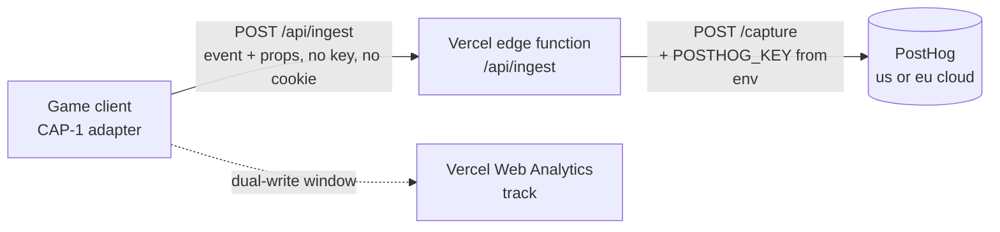

# Reverse proxy: same-origin PostHog capture relay

Spec-authored companion to `SPEC.md` (CAP-2). This is the implementation contract for how events reach PostHog without shipping the `posthog-js` SDK or the project key, while staying cookieless and same-origin. Written to be built from; keep it lean.

## Why not the standard posthog-js setup

PostHog's documented setup ships `posthog-js` (~50 KB gzipped) initialized with the project API key in the client, and (optionally) a Vercel rewrite so requests look first-party for ad-blockers. That setup violates two of this spec's hard constraints at once: it puts a ~50 KB SDK on the boot path of a render-perf-constrained game (the audit's number-one risk), and it puts a write key in a public MIT bundle. PostHog's key is write-only and rate-limited, so exposing it is "acceptable" by PostHog's model, but this project chose the stricter line: no key in the bundle. Both problems dissolve if we never ship the SDK and never put the key in the client.

## Do we need posthog-js to send events? No

Sending an event to PostHog is a plain HTTPS JSON POST to its capture API; `posthog-js` is a convenience SDK, not a transport requirement. In this design the frontend never talks to PostHog at all: it POSTs our own minimal payload to our same-origin `/api/ingest` using the browser's native `fetch`/`sendBeacon`. The relay function then makes one server-side `fetch` to PostHog's capture endpoint. Neither end imports `posthog-js`. What the SDK would add (client-side batching and retries, cookie-based identity, autocapture, session replay) is either unwanted here (cookies, autocapture, replay) or handled directly (a session-scoped id, see the client-side section; best-effort no-retry, matching the retired Vercel path's posture). This is exactly why the client bundle stays near-zero and no key ships.

## The mechanism

The CAP-1 adapter posts our own typed events to a same-origin path. A tiny serverless function forwards them to PostHog's HTTP capture API with the key read from the environment. No SDK, no client key, no third-party domain in the network trace.



### Client side (in the adapter, CAP-1)

- Send with `navigator.sendBeacon("/api/ingest", body)` when available (survives page-hide, which matters for `session_end`), else `fetch("/api/ingest", { method: "POST", body, keepalive: true })`.
- Body is JSON: `{ event, properties, session, ts }`. No API key. No cookie. `properties` is the existing typed prop set plus the CAP-3 `platform` field.
- `session` is a per-session id (`crypto.randomUUID()`) created lazily on the first send and cached in `sessionStorage` (session-scoped: it survives a mid-play reload such as "Update now" or WebGL recovery, and it is cleared when the tab closes; it is not a cookie and not a `localStorage` identifier, and it is never persisted across sessions). It gives within-session correlation (all events from one play session share it) with no cross-session identity: a new tab is a new session. This is the cookieless posture as built in S3; the original sketch here said "in-memory module variable", and the sessionStorage refinement (so a reload does not fragment a session) is the as-built form CAP-2 records.
- Best-effort and never-throw: a failed relay call is swallowed, exactly like the current Vercel path.

### Server side (the relay function)

A Vercel Edge Function (preferred: low cold-start, close to the user) at `/api/ingest`:

1. Accept only POST; reject other methods with 405.
2. Rate-limit per IP (a small fixed window; the function is a public endpoint). Drop over-limit requests with 429 without forwarding.
3. Read `POSTHOG_KEY` and `POSTHOG_HOST` from the environment (never from the request).
4. Forward to `${POSTHOG_HOST}/capture/` with a bare `fetch` (no SDK; `posthog-node` is optional and unnecessary):
   ```json
   {
     "api_key": "<POSTHOG_KEY, server-side>",
     "event": "<event>",
     "properties": {
       "distinct_id": "<session from body>",
       "$process_person_profile": false,
       "...client props..."
     },
     "timestamp": "<ts>"
   }
   ```
   `$process_person_profile: false` keeps PostHog in event-only (no person profile) mode, reinforcing the no-identity posture server-side even if a client ever sent more. The exact capture path and field placement (notably `distinct_id` inside `properties` for `/capture/`) must be confirmed against PostHog's current capture API at implementation time rather than trusted from this sketch.
5. Respond `204` immediately; do not block the client on PostHog's response.
6. Never set a cookie. Never echo the key. Never log the raw IP beyond the rate-limit window.

### Routing config

Two options; pick one at build time:

- **Function route (preferred):** an Edge Function file (for example `api/ingest.ts`) that Vercel serves at `/api/ingest` (files under `/api` map to `/api/<name>`, no config). Gives us rate-limiting and the key injection in code. To use the shorter `/ingest` instead, add a `vercel.json` rewrite of `/ingest` to `/api/ingest` and point the client there.
- **Pure rewrite (rejected here):** a `vercel.json` rewrite `/ingest/:path*` to the PostHog host would make requests same-origin but still requires the client to hold the key and speak PostHog's wire format, so it does not meet the no-key constraint. Documented only so a future reader does not "simplify" toward it.

### Environment

- `POSTHOG_KEY`: the project write key. Deployment env var, never committed, never in the bundle.
- `POSTHOG_HOST`: `https://us.i.posthog.com` or `https://eu.i.posthog.com` (pick the region at setup; EU if data residency ever matters).
- Both are set in Vercel project settings, mirrored to preview and production. Absent key means the function no-ops with 204 (telemetry is best-effort), so a missing secret never breaks the site.

### Dual-write validation window (CAP-4 tie-in)

During validation the adapter sends each event to BOTH the existing Vercel `track` and `/api/ingest`. Compare the PostHog headline counts (founded, first build, boots, sessions) against the Vercel report for the same window. Retire the Vercel path and the `analytics-report.mjs` percentile machinery only after the two agree. `Speed Insights` (Core Web Vitals) is a separate keep-or-drop call made at that point.

### Cost

Both sides are effectively free at current and near-term traffic.

- **PostHog:** product analytics only (no session replay, no feature flags), so the relevant limit is the events allowance, roughly 1 million events per month on the free tier. Current volume is on the order of tens of thousands of events per month (the validated 2-day window is a few thousand events), far inside free. A 10x store-launch spike stays near or under the free allowance.
- **Vercel edge function:** one invocation per relayed request, so tens of thousands of invocations per month at current volume, within the Hobby free function allowance. If invocation count ever matters, the adapter batches several events per request (flush on a timer and on page-hide via `sendBeacon`), cutting invocations toward one per session.
- **Verify at implementation time:** PostHog pricing and the Vercel plan limits change; confirm the current free-tier numbers and the project's Vercel plan when the migration lands rather than trusting these figures, and re-check both if traffic grows by an order of magnitude.

## What this deliberately does not do

- No `posthog-js`, so no autocapture, no session replay, no client-side session stitching beyond the session-scoped id, and no pageview autotracking. All intended: those are the surfaces the privacy posture rules out.
- No cross-session or cross-device identity. The `session` id dies with the tab. Returning-player signal stays the on-device `returning` boolean (SPEC CAP-3), an anonymous bucket, not an identifier.

## Copy/behavior rules

- American English, no em-dashes, no "X, not Y" emphatic restatement.
- If the payload shape here changes, update CAP-2 in `SPEC.md` and the transparency note together; the claim that no identifier leaves the device must stay true.
