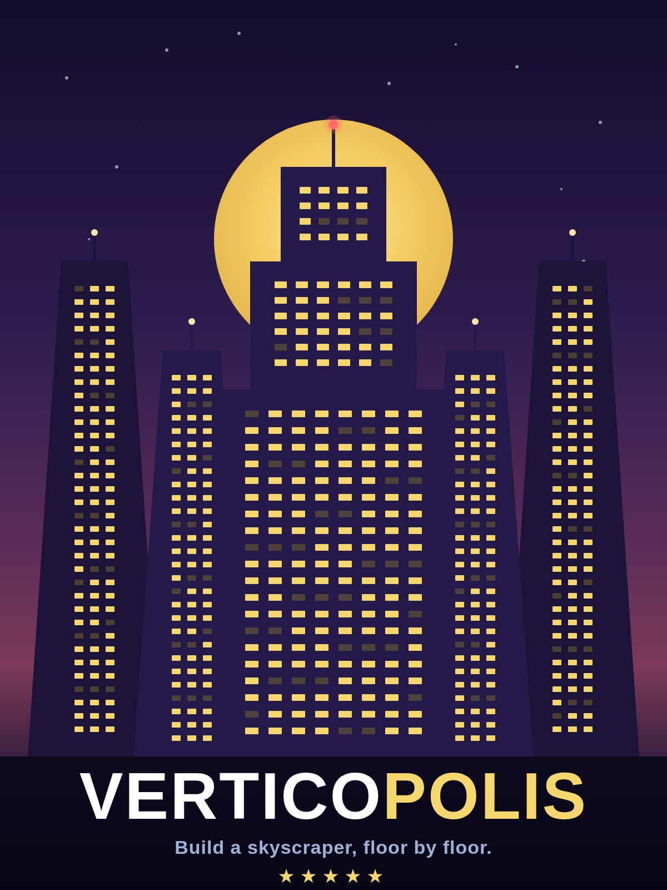
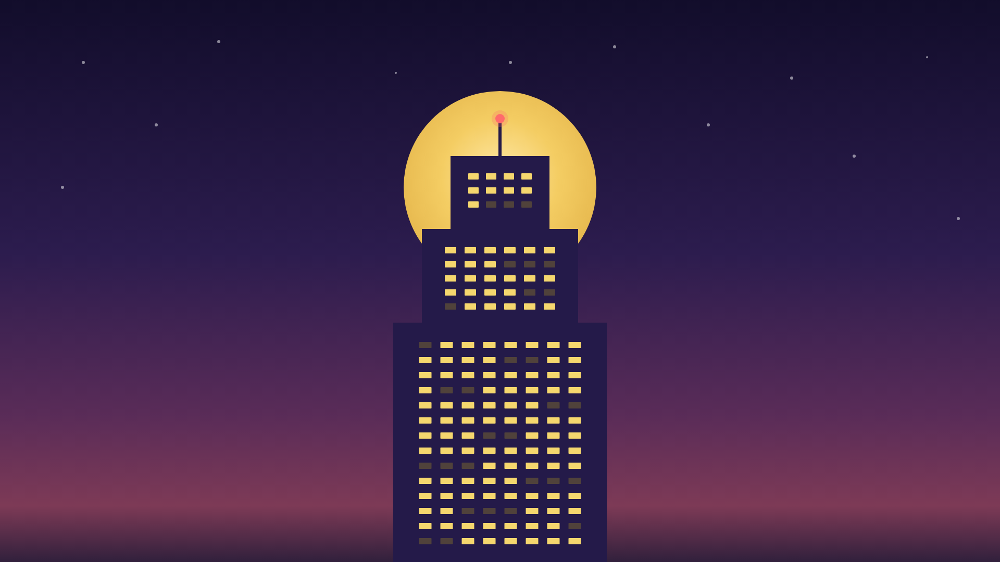
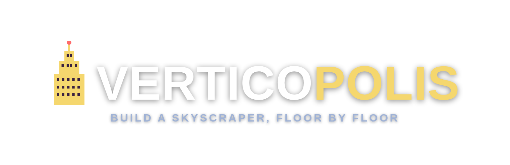

# Press / store assets

Brand assets for external listings (IGDB and similar), rendered in the game's
dusk-skyline brand style.

## Cover (portrait)

- File: `verticopolis-igdb-cover.png`
- Dimensions: 1200x1600, 3:4 (above IGDB's 600x800 minimum)
- Use: the "Default game cover" upload on the IGDB game page.

## Artwork / key art (landscape)

- File: `verticopolis-igdb-artwork.png`
- Dimensions: 1920x1080, 16:9
- Use: the "Artworks" slot on IGDB (page background / banner). Type
  "Key art without logo" (no wordmark, so it works as a background).

## Logo (transparent)

- File: `verticopolis-igdb-logo.png`
- Dimensions: 1600x520, transparent background (PNG alpha)
- Use: the "Logos" slot on IGDB. Reads on dark page backgrounds.
